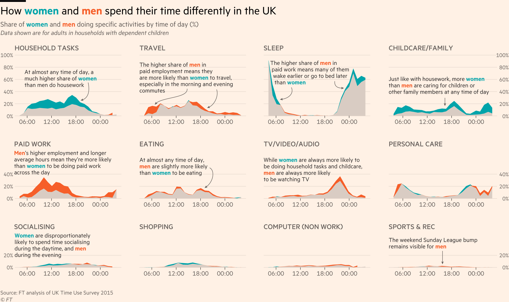
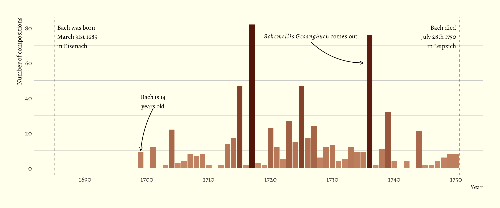
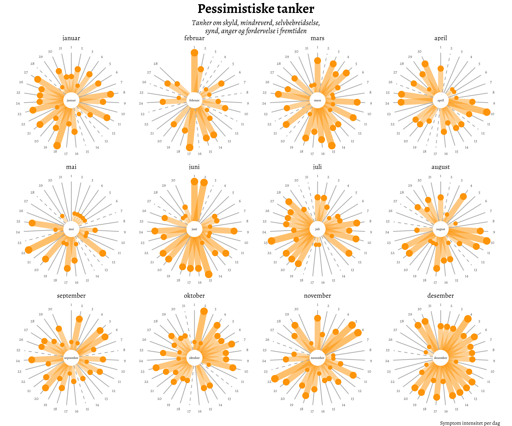
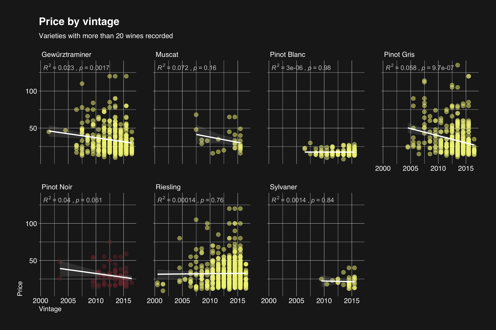
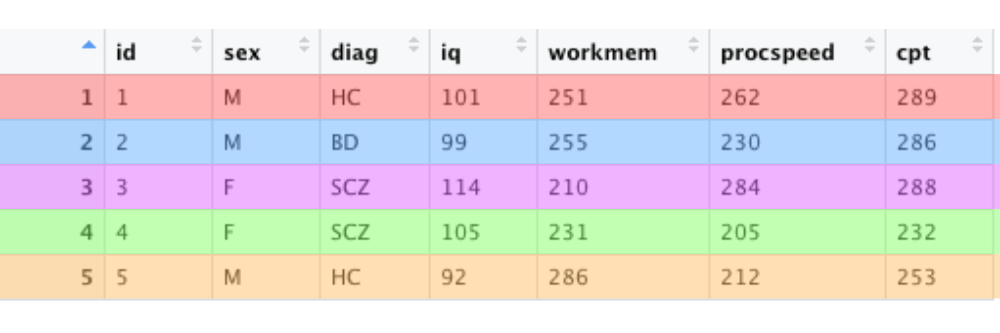
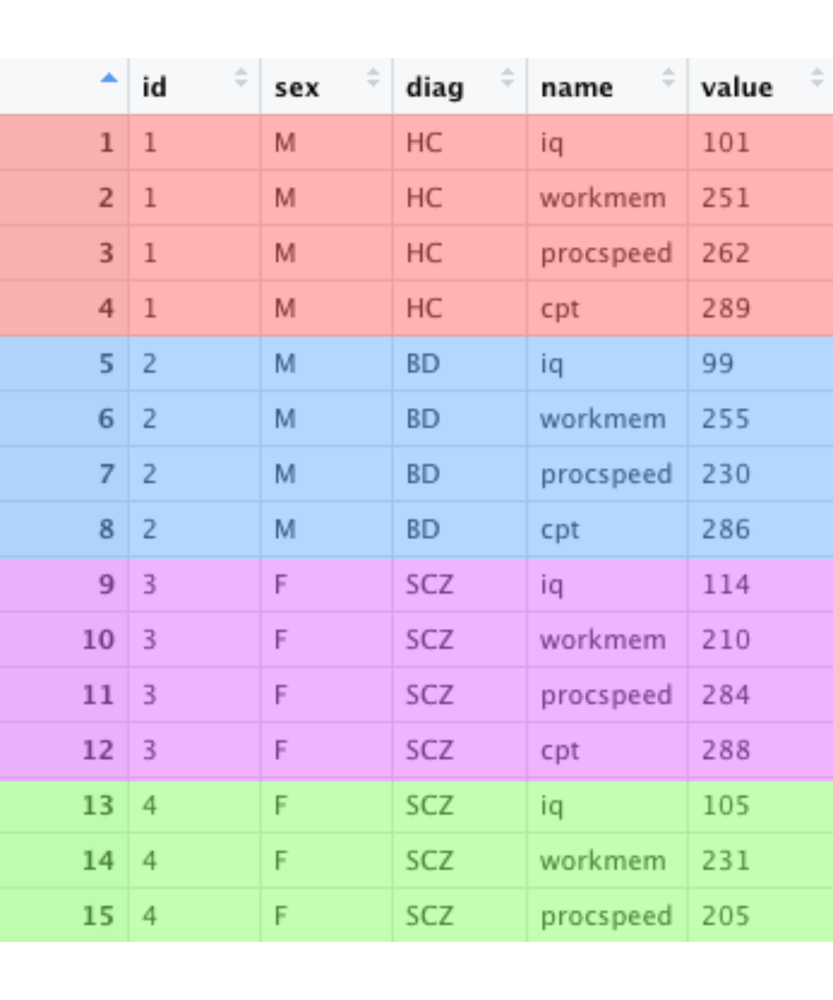
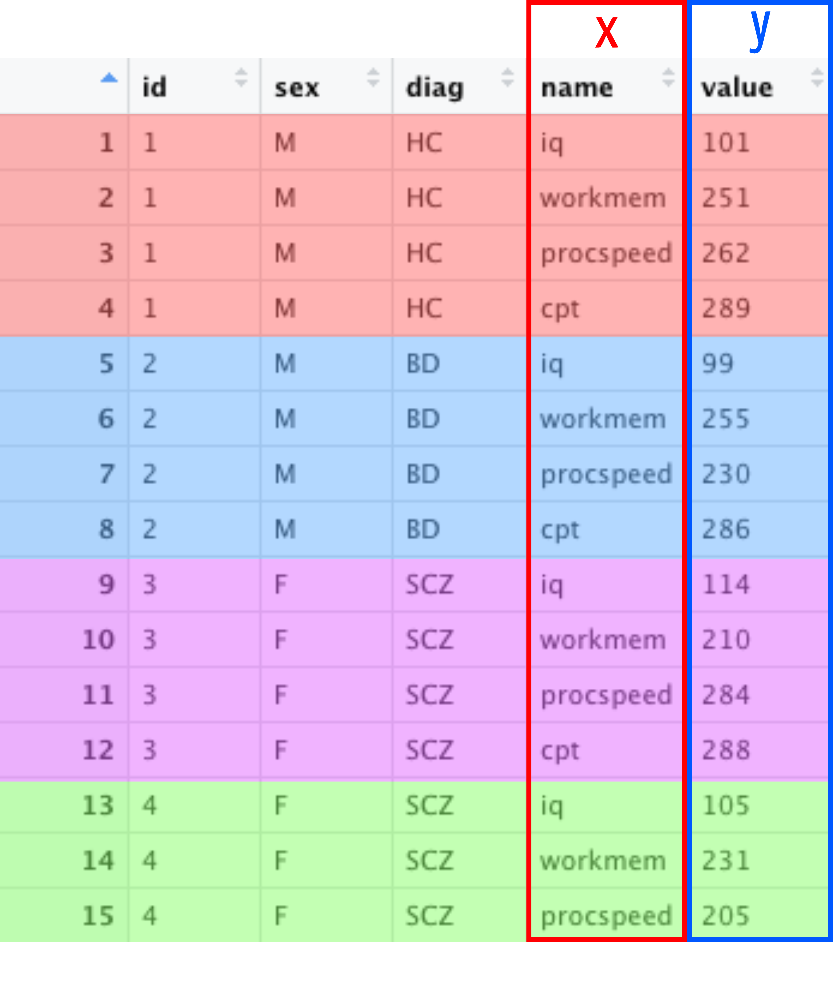
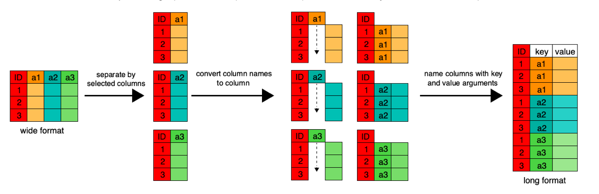

class: center, middle, inverse

```{r setup, include=FALSE}
library(tidyverse)
library(normentR)

setwd("/Users/danielroelfs/Dropbox/NORMENT/R_Scripts/ggplot_tutorial/")

options(htmltools.dir.version = FALSE)
knitr::opts_chunk$set(warning = FALSE, message = FALSE,
                      dpi = 300, fig.retina = 3, fig.show = "hold", fig.align = "center",
                      fig.dim=c(4.8, 4.5))
```

# How to improve our figures

---
class: center, middle, inverse

# When it comes to figure making

&nbsp;&nbsp;&nbsp;&nbsp;<font size="+6"> > </font>&nbsp;&nbsp;&nbsp;&nbsp;

&nbsp;&nbsp;&nbsp;&nbsp;<font size="+6"> > </font>&nbsp;&nbsp;&nbsp;&nbsp;

---
class: center, middle, inverse

# The anatomy of a ggplot

---
class: inverse


---
class: inverse


# Geometries = boxplot, line, scatter, etc.

# Aesthetics = x-axis, y-axis, color, fill, shape

# Data = your awesome TOP data `r emo::ji("smiley")`

---
class: middle

# Installing the packages we need

```{r eval=FALSE}
install.packages("tidyverse") # <- includes ggplot2
devtools::install_github("norment/normentR") # <- themes and colors
```

---
class: middle

# Loading the packages

```{r eval=FALSE}
library(tidyverse)
library(normentR)
```

---

## The skeleton


--

## The code
```{r out.height="40%", out.width="40%", eval=FALSE}
ggplot(data = mtcars, aes(x = wt, y = mpg)) +
  geom_point()
```

<p style="color:#d3d800;">Data: mtcars
<p style="color:#0081c9;">Aethetics: aes(x = wt, y = mpg)
<p style="color:#5c2483;">Geometry: geom_point()

---
class: center, middle, inverse

# ggplot, the layer cake `r emo::ji("cake")`

---

```{r fig.dim=c(4.8, 4.5), out.width="60%"}
ggplot(mtcars, aes(x = wt, y = mpg))
```

---

```{r fig.dim=c(4.8, 4.5), out.width="60%"}
ggplot(mtcars, aes(x = wt, y = mpg)) +
  geom_point() #<<
```

---

```{r fig.dim=c(4.8, 4.5), out.width="60%"}
ggplot(mtcars, aes(x = wt, y = mpg, color = factor(cyl))) + #<<
  geom_point(size = 3) #<<
```

---

```{r fig.dim=c(4.8, 4.5), out.width="60%"}
ggplot(mtcars, aes(x = wt, y = mpg, color = factor(cyl))) +
  geom_point(size = 3) +
  labs(x = "Weight (1000 lbs)", #<<
       y = "Miles/(US) gallon", #<<
       color = "Number of cylinders") #<<
```

---

```{r fig.dim=c(4.8, 4.5), out.width="60%"}
ggplot(mtcars, aes(x = wt, y = mpg, color = factor(cyl))) +
  geom_point(size = 3) +
  labs(x = "Weight (1000 lbs)",
       y = "Miles/(US) gallon",
       color = "Number of cylinders") +
  scale_color_norment(discrete = TRUE, palette = "logo") #<<
```

---

```{r, eval=FALSE}
p <- ggplot(mpg %>% filter(class != "2seater"), 
            aes(x = reorder(class,-cty), y = cty, 
                fill = reorder(class,-cty))) + 
  geom_violin() + 
  geom_boxplot(width = 0.1, outlier.shape = 4) +
  geom_curve(aes(xend = 1.1, yend = 36, x = 1.6, y = 38), 
             curvature = 0.2,
             arrow = arrow(length = unit(2,"mm"))) +
  geom_text(data = . %>% filter(cty == max(cty)),
            aes(x = 2.4, y = 38, 
                label = paste(manufacturer, model, sep = " "))) +
  labs(x = "Class of vehicle",
       y = "City mileage",
       fill = "Class", 
       title = "What class of car has the\nbest mileage in the city?",
       caption = "Source: mpg") +
  scale_x_discrete() +
  scale_y_continuous(limits = c(0,40)) +
  scale_fill_norment(discrete = TRUE, palette = "nejm") +
  theme_norment(legend = FALSE, grid = "Y") +
  theme(
    plot.title = element_text(hjust = -0.1)
  )
```

```{r echo=FALSE, eval=FALSE}
save(p, file = "images/p.Rdata")
```

---

```{r echo=FALSE}
load("images/p.Rdata")
```

```{r fig.dim=c(8, 6), out.width="90%", out.height="90%", eval=TRUE}
print(p)
```

---

# What's possible with ggplot



---

# What's possible with ggplot

```{r echo=FALSE, out.width = "200%"}

```

---

# What's possible with ggplot

```{r echo=FALSE}

```

---

# What's possible with ggplot

```{r echo=FALSE, out.width = "200%"}

```

---
class: center,middle,inverse

# One more (very) important concept:

--

<br>
# Long vs wide format `r emo::ji("smiley")`

---

# Long vs wide format

#### `ggplot` wants a single column for x-axis, y-axis, color, etc

This is often not a problem, e.g.:

```{r echo=FALSE}
your_data <- data.frame(
  id = paste0("HC_0",sample(1e2:9e2, 30)),
  age = sample(18:64, replace = TRUE, 30),
  measure = abs(sample(10:200, 30)/50))
```

```{r}
str(your_data)
print(your_data)
```

---

# Long vs wide format

#### `ggplot` wants a single column for x-axis, y-axis, color, etc

This is often not a problem, e.g.:
```{r out.width="50%"}
ggplot(your_data, aes(x = age, y = measure)) +
  geom_point()
```

---

# Long vs wide format

#### Example of wide format

```{r echo=FALSE}
set.seed(127)
n = 35
wide <- tibble(
  id = 1:n,
  sex = sample(c("F","M"), replace = TRUE, size = n),
  diag = sample(c("HC","SCZ","BD"), replace = TRUE, size = n),
  iq = sample(90:120, replace = TRUE, size = n),
  workmem = sample(200:300, replace = TRUE, size = n),
  procspeed = sample(200:300, replace = TRUE, size = n),
  cpt = sample(200:300, replace = TRUE, size = n)
)
```

```{r eval=FALSE}
View(wide)
```

```{r echo=FALSE}

```

---

# Long vs wide format

#### Conversion to long format

```{r}
long <- pivot_longer(data = wide, 
                     cols = c(iq,workmem,procspeed,cpt))
View(long)
```

```{r echo=FALSE}

```

---

# Long vs wide format

#### Conversion to long format

```{r eval=FALSE}
long <- pivot_longer(data = wide, 
                     cols = c(iq,workmem,procspeed,cpt))
View(long)
```

```{r echo=FALSE}

```

---

# Long vs wide format

#### Conversion to long format

```{r, out.width="400px"}
ggplot(long, aes(x = name, y = value, fill = diag)) +
  geom_boxplot()
```

---

# Long vs wide format

#### Conversion to long format

```{r echo=FALSE, out.width = "800px"}

```

---
class: center, middle, inverse

```{r echo=FALSE, out.width = "800px"}

```

---
class: center, middle, inverse

# Download the data here:

<!--# bit.ly/2UxUNnc-->
# bit.ly/2SntWYd
